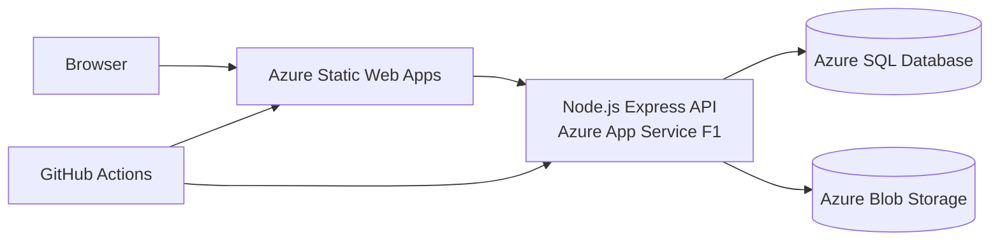

# Architecture

The frontend and API deploy independently, matching the course's W13 deployment model. Local development uses the Vite `/api` proxy. If no Azure SQL connection string is supplied, the API selects an in-memory repository with seeded demonstration records.

## Trust boundaries

- The browser never receives database or storage credentials.
- Passwords are stored only as scrypt hashes; opaque login sessions are stored in HttpOnly cookies.
- A legacy browser-stored profile ID is accepted only so existing profiles can add credentials without losing reports.
- SQL parameters are bound with the `mssql` driver.
- Blob containers remain private; images are streamed through the API.
- Claim proof and replies are returned only to the report owner and that claim's author.

