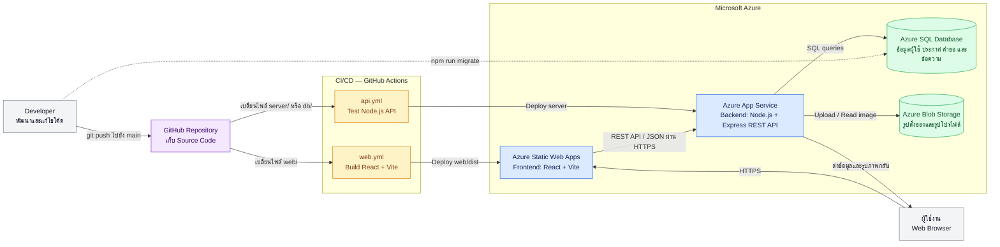

# UP TamHa — Cloud Architecture Overview

แผนภาพนี้แสดงตำแหน่งของ source code, กระบวนการ CI/CD และบริการ Azure ที่ระบบใช้งานจริง

## หน้าที่ของแต่ละส่วน

| ส่วนประกอบ | เทคโนโลยี | หน้าที่ |
|---|---|---|
| Source control | GitHub Repository | เก็บและจัดการ source code ของ Frontend, Backend และ Database migration |
| CI/CD | GitHub Actions | ตรวจสอบโค้ดและ deploy อัตโนมัติเมื่อ push เข้า branch `main` |
| Frontend | React + Vite บน Azure Static Web Apps | แสดงหน้าเว็บและติดต่อ Backend ผ่าน REST API |
| Backend | Node.js + Express บน Azure App Service | จัดการ business logic, authentication, ประกาศ, คำขอรับของ และบทสนทนา |
| Database | Azure SQL Database | เก็บข้อมูลผู้ใช้ session ประกาศ คำขอรับของ และข้อความตอบกลับ |
| Image storage | Azure Blob Storage | เก็บไฟล์รูปสิ่งของและรูปโปรไฟล์แบบ private |

## CI/CD Flow

1. Developer push code ไปยัง branch `main` ใน GitHub
2. หากแก้ `web/` workflow `web.yml` จะ build และ deploy Frontend ไป Azure Static Web Apps
3. หากแก้ `server/` หรือ `db/` workflow `api.yml` จะรัน API tests ก่อน deploy Backend ไป Azure App Service
4. Database migration เป็นขั้นตอนที่รันแยกด้วย `npm run migrate --workspace server` และไม่ได้รันอัตโนมัติใน GitHub Actions

## Trust boundaries

- Browser ไม่ได้รับ database connection string หรือ storage key
- รหัสผ่านถูกเก็บเป็น scrypt hash และ session ใช้ HttpOnly cookie
- Backend เป็นส่วนเดียวที่เชื่อมต่อ Azure SQL Database และ Azure Blob Storage
- Blob container เป็น private และ Backend เป็นผู้ส่งรูปภาพกลับให้ผู้ใช้
- รายละเอียดพิสูจน์ความเป็นเจ้าของและข้อความตอบกลับเปิดให้เห็นเฉพาะคู่สนทนาที่เกี่ยวข้อง
