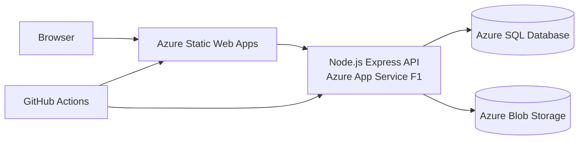

# Architecture

The frontend and API deploy independently, matching the course's W13 deployment model. Local development uses the Vite `/api` proxy. If no Azure SQL connection string is supplied, the API selects an in-memory repository with seeded demonstration records.

## Trust boundaries

- The browser never receives database or storage credentials.
- A browser-stored profile ID keeps the mini-project flow short; it is not security authentication.
- SQL parameters are bound with the `mssql` driver.
- Blob containers remain private; images are streamed through the API.
- Claim proof is returned only on the report-owner route.

