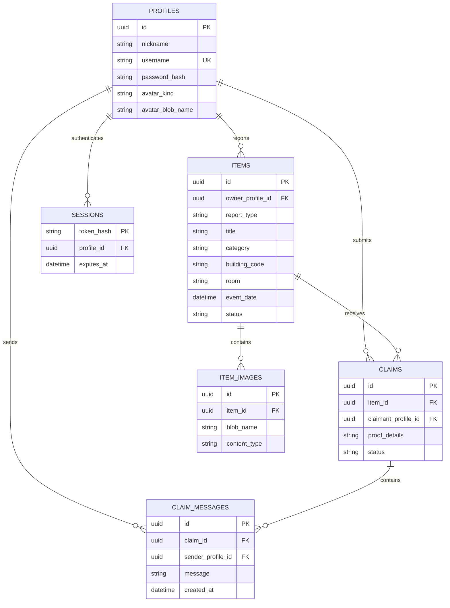

# Data model

```mermaid
erDiagram
    PROFILES ||--o{ ITEMS : reports
    PROFILES ||--o{ CLAIMS : submits
    PROFILES ||--o{ SESSIONS : authenticates
    PROFILES ||--o{ CLAIM_MESSAGES : sends
    ITEMS ||--o{ CLAIMS : receives
    CLAIMS ||--o{ CLAIM_MESSAGES : contains
    ITEMS ||--o{ ITEM_IMAGES : contains

    PROFILES {
      uuid id PK
      string nickname
      string username UK
      string password_hash
      string avatar_kind
      string avatar_blob_name
    }
    ITEMS {
      uuid id PK
      uuid owner_profile_id FK
      string report_type
      string title
      string category
      string building_code
      string room
      datetime event_date
      string status
    }
    CLAIMS {
      uuid id PK
      uuid item_id FK
      uuid claimant_profile_id FK
      string proof_details
      string status
    }
    CLAIM_MESSAGES {
      uuid id PK
      uuid claim_id FK
      uuid sender_profile_id FK
      string message
      datetime created_at
    }
    SESSIONS {
      string token_hash PK
      uuid profile_id FK
      datetime expires_at
    }
    ITEM_IMAGES {
      uuid id PK
      uuid item_id FK
      string blob_name
      string content_type
    }
```

Statuses are `OPEN`, `CLAIM_PENDING`, `MATCHED`, `RETURNED`, and `CLOSED`. Claim statuses are `PENDING`, `APPROVED`, and `REJECTED`.

